# Database

PostgreSQL 16 managed through Prisma. The schema (`apps/api/prisma/schema.prisma`) is the single
source of truth; migrations are generated from it.

## ER diagram

```mermaid
erDiagram
    Company ||--o{ User : employs
    Company ||--o{ Project : owns
    Company ||--o{ Invoice : billed
    Company ||--o{ Payment : pays
    Company ||--o{ Subscription : subscribes
    Company ||--o{ Quote : receives
    Company ||--o{ Contract : signs
    Company ||--o{ Ticket : raises

    User ||--o{ RefreshToken : sessions
    User ||--o{ VerificationToken : tokens
    User ||--o{ ProjectMember : joins
    User ||--o{ Task : "assigned/reported"
    User ||--o{ TaskComment : writes
    User ||--o{ TimeEntry : logs
    User ||--o{ Ticket : requests
    User ||--o{ TicketMessage : replies
    User ||--o{ Notification : receives
    User ||--o{ AuditLog : generates
    User ||--o{ AiConversation : chats
    User ||--o{ ConversationParticipant : participates
    User ||--o{ BlogPost : authors
    User ||--o{ KbArticle : authors
    User ||--o{ FileAsset : uploads

    Project ||--o{ ProjectMember : has
    Project ||--o{ Milestone : has
    Project ||--o{ Task : contains
    Project ||--o{ FileAsset : stores
    Project ||--o{ Invoice : bills
    Project ||--o{ Contract : covers
    Milestone ||--o{ Task : groups
    Task ||--o{ TaskComment : has
    Task ||--o{ TimeEntry : tracks
    Task ||--o{ FileAsset : attaches

    Invoice ||--o{ InvoiceItem : lines
    Invoice ||--o{ Payment : settled_by
    TaxRate ||--o{ Invoice : taxes
    TaxRate ||--o{ Quote : taxes
    DiscountCode ||--o{ Invoice : discounts
    Payment ||--o{ Refund : refunded_by
    Plan ||--o{ Subscription : defines
    Subscription ||--o{ Payment : renews
    Quote ||--o{ QuoteItem : lines

    TicketCategory ||--o{ Ticket : classifies
    Ticket ||--o{ TicketMessage : thread
    Ticket ||--o{ FileAsset : attaches

    KbCategory ||--o{ KbArticle : groups
    BlogCategory ||--o{ BlogPost : groups
    JobPosting ||--o{ JobApplication : receives

    Conversation ||--o{ ConversationParticipant : includes
    Conversation ||--o{ ChatMessage : contains
    AiConversation ||--o{ AiMessage : contains
```



Standalone tables: `PortfolioItem` (with embedded case-study fields), `Testimonial`, `FaqItem`,
`ContactSubmission`, `NewsletterSubscriber`, `Setting` (key/JSON value).

## Design notes

- **Keys** — UUID primary keys everywhere except `Ticket.number` (human-friendly autoincrement).
- **Money** — `Decimal(12,2)`; percentages `Decimal(5,2)`. Never floats.
- **Soft vs hard delete** — users are deactivated (`isActive=false`, sessions revoked); business
  documents (paid invoices, signed contracts) are status-transitioned (VOID/TERMINATED), never
  deleted. Cascades remove dependent rows (items, messages, tokens) with their parents.
- **Sensitive data at rest** — passwords: bcrypt (cost 12); TOTP secrets: AES-256-GCM; refresh
  and verification tokens: SHA-256 hashes (the raw value only ever exists in transit).
- **Search** — `contains` filters with per-resource scoring in the app layer (KB/FAQ) — no
  external search engine required. `keywords[]`/`tags[]` arrays support exact-term hits.
- **Constraints** — unique: emails, slugs, invoice/quote numbers, discount codes,
  `(projectId,userId)` membership, `(conversationId,userId)` participation. Enum types encode
  every workflow's legal states.

## Indexes

Foreign keys and the hot query paths are covered:
`User(companyId, role)` · `Project(companyId, status, managerId)` · `Task(projectId+status,
assigneeId, milestoneId)` · `Invoice(companyId+status, dueDate)` · `Payment(companyId, invoiceId)`
· `Subscription(companyId+status, currentPeriodEnd)` · `Ticket(status+priority, requesterId,
assigneeId, companyId)` · `Notification(userId+readAt)` · `AuditLog(userId+createdAt,
entityType+entityId, action)` · `ChatMessage(conversationId+createdAt)` ·
`BlogPost(status+publishedAt)` · `KbArticle(categoryId+status)` and more — see the schema.

## Migrations

```bash
pnpm db:migrate            # dev: generate + apply a migration from schema changes
pnpm db:deploy             # prod: apply committed migrations (runs automatically in Docker)
pnpm db:studio             # browse data
```

Workflow: edit `schema.prisma` → `pnpm db:migrate --name describe_change` → commit the generated
folder under `prisma/migrations/`. Never edit applied migrations; roll forward instead.

## Seeding

`pnpm db:seed` (idempotent for users) creates: four role accounts, a demo client company with an
in-flight project (milestones, kanban tasks), pricing plans, tax rates, a sent invoice, ticket
categories, a searchable knowledge base, FAQ, blog posts, portfolio/case studies, testimonials,
job postings, and platform settings.
